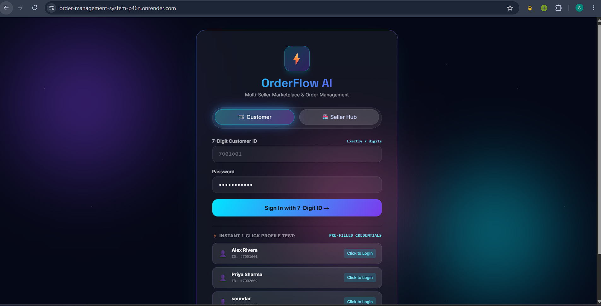
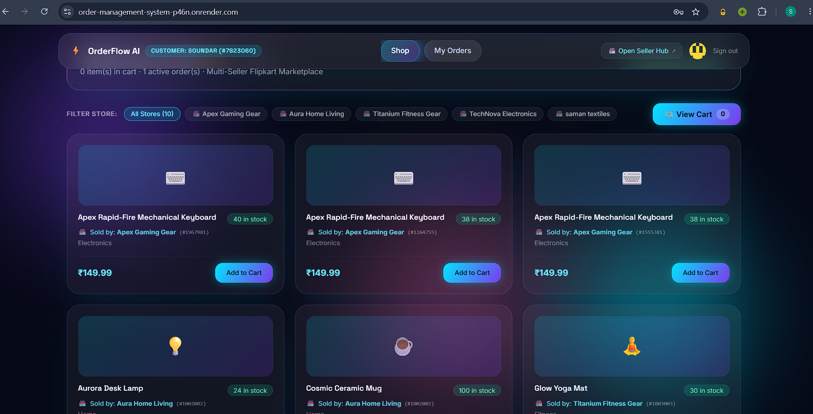
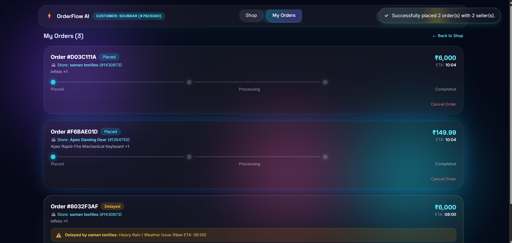
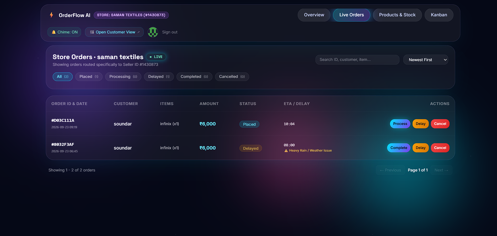
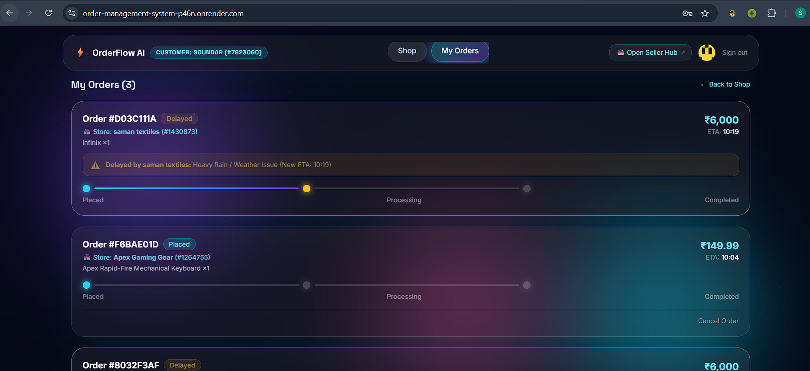
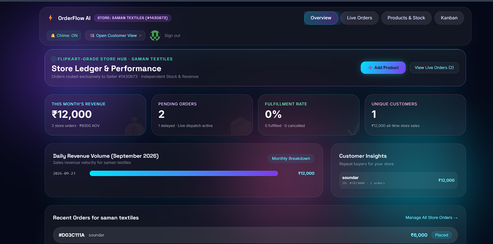
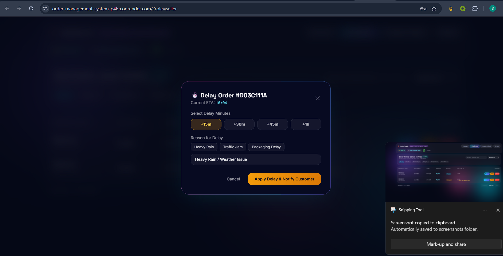

# OrderFlow AI v2.0 — Real-Time Multi-Seller Operations, Admin Governance & Marketplace

> **A Flipkart-Grade Real-Time Order Management System** featuring **VisionOS Neon-Glassmorphism UI**, **Admin Governance & Multi-Admin Approval Chains**, **Seller KYC Verification**, **Smart Apology-First Support Chat**, **Gemini 2.0 Flash AI Insights**, **GST PDF Tax Invoices**, **PWA Offline Support**, **Dark/Light Theme Switching**, **bcrypt Security**, and **Dual SQLite/PostgreSQL Engine**.

---

## 🌟 What's New in v2.0

### 1. 🛡️ Admin Governance & Strict Approval Chain
- **Zero Default Admin**: No hardcoded admin credentials exist in code.
- **First-Time Admin Bootstrap**: The initial primary admin is securely initialized via the one-time `/admin/setup` onboarding flow with a custom password.
- **Admin Approval Chain**: Any subsequent admin registrations are held in `pending_admin_approval` and require explicit approval/rejection by the primary founder admin before they can log in.
- **Founding Admin Immutability**: The primary founding admin cannot be suspended or demoted (`is_first_admin=1`).
- **7-Tab Mission-Control Dashboard**:
  1. **Overview**: Platform GMV, orders, user metrics, real-time charts.
  2. **Seller Verification**: Review KYC details, approve/reject seller applications.
  3. **All Users**: Filter, search, and toggle suspension status across customers, sellers, and admins.
  4. **All Orders**: Global cross-seller order manager with status overrides.
  5. **Support Desk**: Real-time customer/seller complaint desk with star ratings.
  6. **Admin Accounts**: Manage permissions and pending admin applications.
  7. **Platform Config & Coupons**: Inspect environment toggles and platform-wide promo codes.

### 2. 🏪 Seller KYC Verification Protocol
New sellers must provide full KYC onboarding information before they can list products:
- **Brand / Store Name** & Contact Name
- **State Selection** (Full list of Indian states & Union Territories)
- **Verified Phone Number** & Product Category
- **Warehouse / Stock Address**
- **Order Acceptance Mode**: Auto-accept orders or manual seller review
- **RTO Handling Mode**: Marketplace return logistics or self-inspected warehouse restock
- **Seller Gating**: Sellers start as `pending_verification` and are blocked from listing items until approved by the admin.

### 3. 💬 Smart Support Chat with Sincere Apology Flow
- Floating support widget (FAB) available across all customer and seller screens.
- Instant predefined sympathetic responses for common queries (*Order Tracking*, *Return/Exchange*, *Payment Verification*).
- **Complaint Protocol**: For any complaint or negative review, the system **always apologizes sincerely first** before asking for 1–5 star ratings and issue descriptions, connecting the user directly to the live Admin Support Desk.

### 4. 🤖 AI, Payments & Financial Documents (Priority 2)
- **Gemini 2.0 Flash AI**: Auto-generate compelling SEO product descriptions and predictive inventory restock recommendations.
- **GST Tax Invoices**: Download official A4 PDF invoices generated via ReportLab with 18% GST (CGST/SGST) breakdown.
- **Razorpay Payments**: Integrated Razorpay payment gateway with live HMAC-SHA256 signature verification and test mock fallback.
- **Transactional Emails**: Automated email dispatch for registration, order updates, and approvals via Resend.

### 5. 🎨 UI Polish & Progressive Web App (Priority 4)
- **Installable PWA**: Modern `manifest.json` and service worker (`sw.js`) with network-first caching.
- **Dark & Light Mode Switcher**: Smooth theme transitions with persisted preferences in `localStorage`.
- **Seller Storefront Branding**: Sellers can customize their brand color, logo, and banner URL in real time.

---

## 🔑 Test Accounts & Demo Access

| Role | ID | Password | Name / Store | Details |
| :--- | :--- | :--- | :--- | :--- |
| **Founder Admin** | `956673` *(6 Digits)* | `Soundar@52122` | **Soundararajan** | Master Founder Admin · Full Governance & Approvals |
| **Junior Admin** | `989809` | `SarahPassword@123` | **Sarah Jenkins** | Approved Junior Admin |
| **Seller** | `1001001` | `seller123` | **TechNova Electronics** | Electronics Store |
| **Seller** | `1138864` | `VikramPassword@123` | **Zenith Artisan Crafts** | Verified KYC Seller |
| **Customer** | `7001001` | `customer123` | **Alex Rivera** | Verified Customer |
| **Customer** | `7002002` | `customer123` | **Priya Sharma** | Verified Customer |


---

## 🚀 How to Deploy on the Web (Free)

The project is structured so **FastAPI serves both the backend API, WebSockets, and the frontend UI under a single URL**.

### Option 1: Deploy on Render.com (Recommended - 100% Free)

1. Go to **[Render.com](https://render.com/)** and sign in with your GitHub account.
2. Click **New +** → **Web Service**.
3. Select your repository: `soundararajan-1/ORDER-MANAGEMENT-SYSTEM`.
4. Configure the service:
   - **Name**: `orderflow-ai` (or any name you prefer)
   - **Region**: Choose the closest region (e.g. *Singapore* or *Frankfurt*)
   - **Runtime**: `Python 3`
   - **Build Command**:
     ```bash
     pip install -r OrderFlow-AI/backend/requirements.txt
     ```
   - **Start Command**:
     ```bash
     uvicorn OrderFlow-AI.backend.main:app --host 0.0.0.0 --port $PORT
     ```
   - **Instance Type**: `Free`
5. Click **Create Web Service**.
6. Render will build and deploy your app in ~2 minutes and provide a free live URL:
   `https://orderflow-ai.onrender.com`

---

### Option 2: Deploy on Railway.app

1. Go to **[Railway.app](https://railway.app/)** and connect GitHub.
2. Click **New Project** → **Deploy from GitHub repo** → select `ORDER-MANAGEMENT-SYSTEM`.
3. In the project settings, set:
   - **Start Command**: `uvicorn OrderFlow-AI.backend.main:app --host 0.0.0.0 --port $PORT`
4. Click **Generate Domain** under Settings → Networking to get your public HTTPS URL!

---

### Option 3: Deploy with Docker

A production-ready `Dockerfile` is included in the repository. Deploy to any Docker-supported cloud:

```bash
docker build -t orderflow-ai .
docker run -p 8000:8000 orderflow-ai
```
Visit `http://localhost:8000` in your browser.

---

## 💻 Local Development

```bash
# 1. Clone repository
git clone https://github.com/soundararajan-1/ORDER-MANAGEMENT-SYSTEM.git
cd ORDER-MANAGEMENT-SYSTEM/OrderFlow-AI

# 2. Install backend dependencies
cd backend
pip install -r requirements.txt

# 3. Start backend
python -m uvicorn main:app --reload --port 8000

# 4. Open in browser
# Visit http://127.0.0.1:8000 (FastAPI serves frontend directly!)
```

---

## 💡 Recommendations & Future Roadmap

Here are high-impact features recommended for future updates:

1. **Persistent Cloud Database (PostgreSQL / Supabase)**:
   - Connect free managed PostgreSQL (Supabase / Neon) so data persists permanently across container restarts.
2. **Downloadable Tax Invoice & Shipping Labels (PDF)**:
   - Add a button for sellers to generate printable PDF GST invoices with barcodes and order addresses.
3. **Discount Coupons & Promotional Deals**:
   - Allow sellers to create coupon codes (e.g. `SAVE20`, `FREESHIP`) and banner announcements.
4. **Direct Seller-Customer Live Chat**:
   - Order-specific real-time chat over WebSockets to ask about delivery instructions.
5. **Payment Gateway Integration (Test Mode)**:
   - Integrate Razorpay or Stripe sandbox for credit card, UPI, and net-banking checkout.
6. **Dark / Light Theme & Store Branding**:
   - Let sellers upload custom store banners and choose brand highlight colors.
PROJECT OUTCOMES:
<h2>📸 Project Screenshots</h2>

<h3>🔐 Login Page</h3>


<h3>🛒 Customer Page</h3>


<h3>👤 Customer Details</h3>


<h3>🛍️ Order Management</h3>


<h3>📦 Order Tracking</h3>


<h3>🏪 Seller Dashboard</h3>


<h3>⏰ Order Delay Reason</h3>

