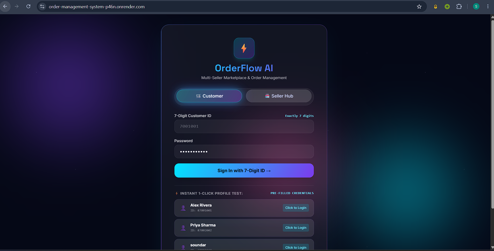
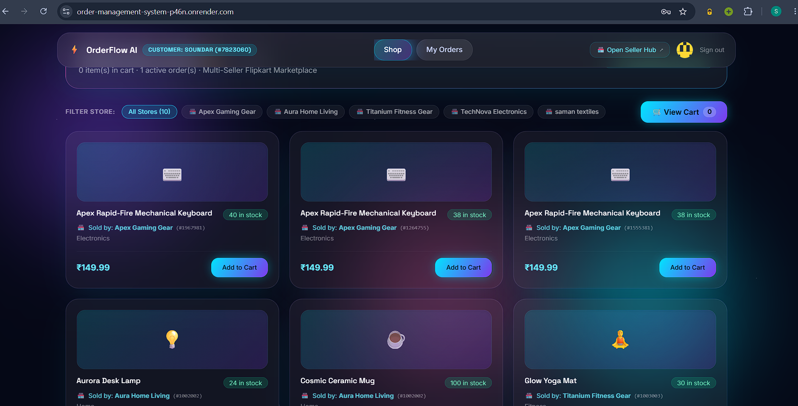
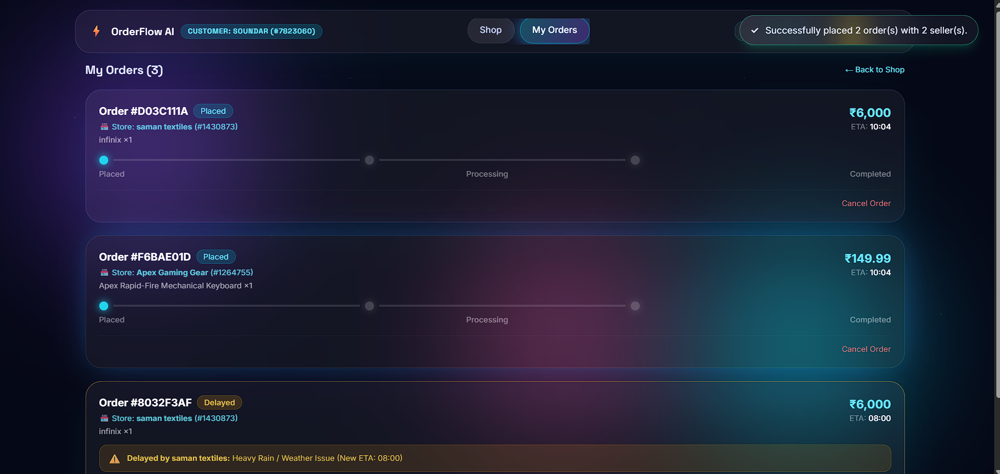
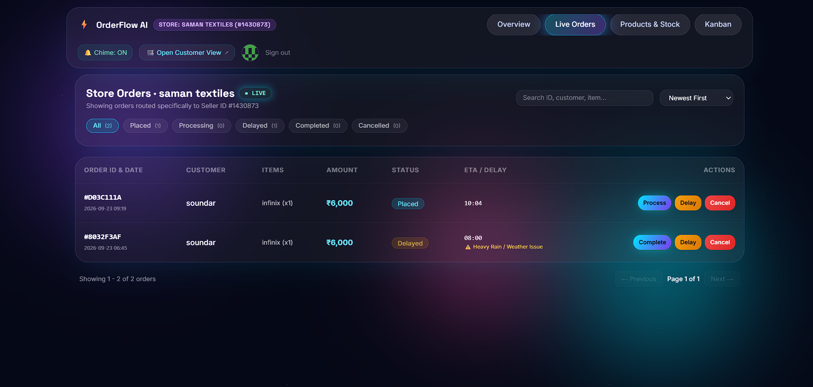
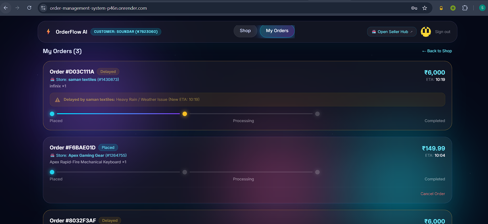
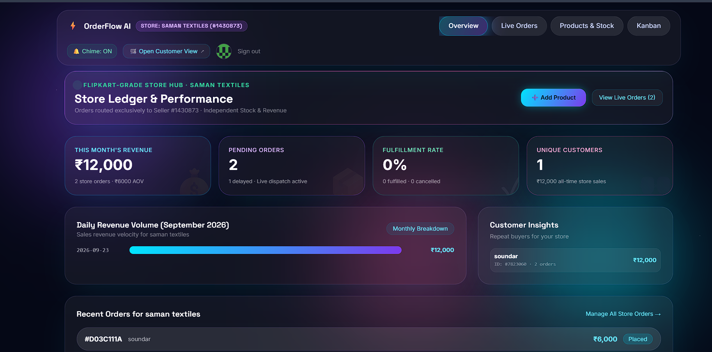
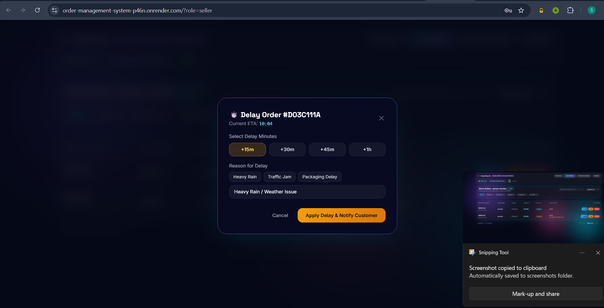

<div align="center">

# OrderFlow AI — Real-Time Multi-Seller Operations, Autonomous AI Sentinel & Marketplace

[](https://orderflow-ai.onrender.com)
[](https://render.com/deploy?repo=https://github.com/soundararajan-1/ORDER-MANAGEMENT-SYSTEM)
[](https://railway.app/template/new?template=https://github.com/soundararajan-1/ORDER-MANAGEMENT-SYSTEM)

[](https://fastapi.tiangolo.com)
[](https://python.org)
[](https://ai.google.dev)
[](https://www.docker.com)
[](#)
[](#)
[](#)

> **A Flipkart-Grade Real-Time Order Management System** featuring **Autonomous AI Supply Chain Sentinel Agent**, **1-Click Judge Chaos Operations Sandbox**, **VisionOS Neon-Glassmorphism UI**, **Admin Governance & Multi-Admin Approval Chains**, **Seller KYC Verification**, **Smart Apology-First Support Chat**, **Gemini 2.0 Flash AI Insights**, **GST PDF Tax Invoices**, **PWA Offline Support**, **Dark/Light Theme Switching**, **bcrypt Security**, and **Dual SQLite/PostgreSQL Engine**.

</div>

---

> ### 🌐 [⚡ Click Here to Launch the Live Interactive Demo](https://orderflow-ai.onrender.com)
>
> **Instant Demo Access**: The cloud demo is pre-seeded with multi-seller products, active orders, and real-time tracking simulations:
> - 🛡️ **Founder Admin**: ID `956673` · Password `Soundar@52122` *(Full governance, seller KYC approvals, chaos ledger)*
> - 🏪 **Verified Seller**: ID `1001001` · Password `seller123` *(TechNova Electronics, inventory, orders, AI descriptions)*
> - 🛍️ **Customer**: ID `7001001` · Password `customer123` *(Shop, cart, live tracking, smart apology support chat)*
> - ⚡ **Floating Judge Sandbox**: Tap the dock icon in the bottom-right corner of any screen for 1-click simulations (**Courier Delay + AI Auto-Voucher**, **Flash Sale Surge**, **Low Stock Chaos**).

---

## 🌟 Autonomous AI Sentinel & 1-Click Operations Sandbox (Judge Magnet)

### 🤖 1. Autonomous AI Supply Chain Sentinel Agent
- **Proactive Delay Detection & Auto-Resolution**: When an order encounters transit weather disruptions, cargo highway congestion, or sorting facility jams, the Sentinel Agent autonomously intervenes.
- **Dynamic Apology Coupon Provisioning**: Calculates delay severity and automatically generates a genuine, single-use compensation voucher (e.g. `SENTINEL-ORD1-XXXX` for flat ₹50–₹100 OFF) directly inserted into the database.
- **Empathetic AI Apology & Retention**: Synthesizes a personalized apology directly to the customer's chat and push notification, safeguarding seller NPS and preventing order cancellation churn.
- **Admin Governance Audit Trail**: Every autonomous intervention is recorded in `sentinel_logs` with severity, delay reason, courtesy voucher, and AI decision trace accessible via the new **🤖 AI Sentinel Tab** in the Admin Dashboard.

### ⚡ 2. Live Demo Simulator (Judge Chaos Sandbox)
A floating VisionOS widget accessible at all times with 1-click live presentation triggers:
- 🔴 **Simulate Courier Delay**: Injects a live transit delay, triggering the AI Sentinel's real-time apology modal and auto-coupon generation.
- 🚀 **Simulate Flash Sale Rush**: Injects 5 simulated multi-city concurrent orders across sellers with live GMV recalculation, inventory decrementing, and real-time confetti/sound celebrations.
- 📦 **Simulate Low Stock Alert**: Depletes inventory to 2 units, triggering an automated Gemini restock alert.
- 📋 **View Sentinel Audit Log**: Instant modal view of historical autonomous interventions and courtesy discounts.

---

## 🌟 Core Architecture & Governance

### 1. 🛡️ Admin Governance & Strict Approval Chain
- **Zero Default Admin**: No hardcoded admin credentials exist in code.
- **First-Time Admin Bootstrap**: The initial primary admin is securely initialized via the one-time `/admin/setup` onboarding flow with a custom password.
- **Admin Approval Chain**: Any subsequent admin registrations are held in `pending_admin_approval` and require explicit approval/rejection by the primary founder admin before they can log in.
- **Founding Admin Immutability**: The primary founding admin cannot be suspended or demoted (`is_first_admin=1`).
- **7-Tab Mission-Control Dashboard**:
  1. **Overview**: Platform GMV, orders, user metrics, real-time charts.
  2. **Seller Verification**: Review KYC details, approve/reject seller applications.
  3. **All Users**: Filter, search, and toggle suspension status across customers, sellers, and admins.
  4. **All Orders**: Global cross-seller order manager with status overrides.
  5. **Support Desk**: Real-time customer/seller complaint desk with star ratings.
  6. **Admin Accounts**: Manage permissions and pending admin applications.
  7. **Platform Config & Coupons**: Inspect environment toggles and platform-wide promo codes.

### 2. 🏪 Seller KYC Verification Protocol
New sellers must provide full KYC onboarding information before they can list products:
- **Brand / Store Name** & Contact Name
- **State Selection** (Full list of Indian states & Union Territories)
- **Verified Phone Number** & Product Category
- **Warehouse / Stock Address**
- **Order Acceptance Mode**: Auto-accept orders or manual seller review
- **RTO Handling Mode**: Marketplace return logistics or self-inspected warehouse restock
- **Seller Gating**: Sellers start as `pending_verification` and are blocked from listing items until approved by the admin.

### 3. 💬 Smart Support Chat with Sincere Apology Flow
- Floating support widget (FAB) available across all customer and seller screens.
- Instant predefined sympathetic responses for common queries (*Order Tracking*, *Return/Exchange*, *Payment Verification*).
- **Complaint Protocol**: For any complaint or negative review, the system **always apologizes sincerely first** before asking for 1–5 star ratings and issue descriptions, connecting the user directly to the live Admin Support Desk.

### 4. 🤖 AI, Payments & Financial Documents (Priority 2)
- **Gemini 2.0 Flash AI**: Auto-generate compelling SEO product descriptions and predictive inventory restock recommendations.
- **GST Tax Invoices**: Download official A4 PDF invoices generated via ReportLab with 18% GST (CGST/SGST) breakdown.
- **Razorpay Payments**: Integrated Razorpay payment gateway with live HMAC-SHA256 signature verification and test mock fallback.
- **Transactional Emails**: Automated email dispatch for registration, order updates, and approvals via Resend.

### 5. 🎨 UI Polish & Progressive Web App (Priority 4)
- **Installable PWA**: Modern `manifest.json` and service worker (`sw.js`) with network-first caching.
- **Dark & Light Mode Switcher**: Smooth theme transitions with persisted preferences in `localStorage`.
- **Seller Storefront Branding**: Sellers can customize their brand color, logo, and banner URL in real time.

### 6. 🔐 Password Self-Service & Admin User Deletion
- **Change Password**: Any logged-in Customer, Seller, or Admin can update their password via the `🔑 Password` modal on the top navigation bar.
- **Forgot Password Recovery**: Secure self-service recovery directly from the login screen verifying registered **Birth Place** or **Favorite Person** security answers (with case-insensitive matching).
- **Show/Hide Password Visibility Toggles**: Interactive eye toggles (`👁️`) available across all sign-in, registration, reset, and password modification forms.
- **Admin User ID Removal**: Administrators can permanently delete user IDs for Customers, Sellers, or Junior Admins with immediate session revocation. The Master Founder Admin (`956673`) is immutably protected from deletion or suspension.

### 7. 🛡️ Autonomous AI Delay Sentinel & 1-Click Operations Sandbox
- **Autonomous Delay Sentinel**: When logistics disruptions or courier delays occur, the AI Sentinel automatically assesses delay severity (Minor, Moderate, Critical), composes an empathetic customer apology, dynamically generates a courtesy compensation voucher (`SENTINEL-XXXX`), and broadcasts notifications across live WebSockets.
- **Floating 1-Click Operations Sandbox (Judge Demo Tool)**: Floating VisionOS dock widget in the bottom-right corner allowing 1-click simulation of:
  - ⏱️ **Simulate Delay (+35m)**: Triggers live AI Sentinel intervention with auto-voucher creation and customer order chat notification.
  - ⚡ **Flash Sale Surge (+5 Orders)**: Instantly generates concurrent incoming orders and boosts GMV.
  - 🚨 **Low Stock Chaos (<3 units)**: Instantly triggers low-stock warnings and AI predictive restock recommendations.
- **Admin Sentinel Audit Tab (Tab 8)**: Full observability ledger with severity badges, auto-generated coupon codes, apology transcripts, and AI analysis rationale.

### 8. 📸 Product Multi-Image Support (Max 5) & 💬 Customer Feedback/Reviews
- **Multi-Image Catalog (Strict Max 5 Photos)**:
  - Sellers can upload up to 5 photos per product using local file selection (PNG/JPG/WEBP converted to Base64) or direct image URLs.
  - 1st photo is automatically designated as the primary cover photo across shop cards and inventory tables.
  - Visual preview strip with remove buttons (`✕`), cover indicator (`★ Cover`), and limit counter (`X / 5`).
  - Strict enforcement on both frontend and backend (rejects any attempt to exceed 5 images with HTTP 400).
  - Existing products can be updated anytime with new/replaced photos via the `✏️ Edit & Photos` inventory action.
- **Customer Feedback & Rating Section**:
  - Every product features a dedicated feedback and rating section accessible via product cards or details modal.
  - Customers can submit 1–5 star ratings with detailed written feedback.
  - Interactive star rating picker with responsive hover labels (*1 Star - Terrible* to *5 Stars - Excellent*).
  - Real-time recalculation of product average rating (`avg_rating`) and total review count (`review_count`).
  - Multi-image gallery carousel with thumbnail switcher and photo counter inside the product details modal.

---

## 🔑 Test Accounts & Demo Access

| Role | ID | Password | Name / Store | Details |
| :--- | :--- | :--- | :--- | :--- |
| **Founder Admin** | `956673` *(6 Digits)* | `Soundar@52122` | **Soundararajan** | Master Founder Admin · Full Governance & Approvals |
| **Junior Admin** | `989809` | `SarahPassword@123` | **Sarah Jenkins** | Approved Junior Admin |
| **Seller** | `1001001` | `seller123` | **TechNova Electronics** | Electronics Store |
| **Seller** | `1138864` | `VikramPassword@123` | **Zenith Artisan Crafts** | Verified KYC Seller |
| **Customer** | `7001001` | `customer123` | **Alex Rivera** | Verified Customer |
| **Customer** | `7002002` | `customer123` | **Priya Sharma** | Verified Customer |


---

## 🚀 1-Click Cloud Deployment (Free)

The project is structured so **FastAPI serves both the backend API, WebSockets, and the frontend UI under a single URL**. Configured with root-level `render.yaml`, `railway.json`, `Procfile`, and `Dockerfile`.

### 🌟 Option 1: 1-Click Deploy on Render (Recommended - 100% Free)

[](https://render.com/deploy?repo=https://github.com/soundararajan-1/ORDER-MANAGEMENT-SYSTEM)

1. Click the **Deploy to Render** button above (or open [Render.com](https://render.com/deploy?repo=https://github.com/soundararajan-1/ORDER-MANAGEMENT-SYSTEM)).
2. Sign in with GitHub and click **Apply Blueprint**.
3. Render automatically reads [render.yaml](file:///c:/Users/ttcre/Downloads/OrderFlow-AI/render.yaml), installs Python dependencies, provisions environment variables, and launches the web service.
4. Your application will be live in ~2 minutes at:
   `https://orderflow-ai.onrender.com`

---

### 🚆 Option 2: 1-Click Deploy on Railway

[](https://railway.app/template/new?template=https://github.com/soundararajan-1/ORDER-MANAGEMENT-SYSTEM)

1. Click the **Deploy on Railway** button above.
2. Sign in with GitHub and select your repository.
3. Railway automatically detects [railway.json](file:///c:/Users/ttcre/Downloads/OrderFlow-AI/railway.json) and [Dockerfile](file:///c:/Users/ttcre/Downloads/OrderFlow-AI/Dockerfile).
4. Click **Deploy Now** and generate your public domain under **Settings → Networking**!

---

### 🐳 Option 3: Deploy with Docker

A production-ready `Dockerfile` is included in the root directory. Deploy anywhere Docker is supported (Render, AWS, DigitalOcean, Fly.io):

```bash
# Build the Docker image
docker build -t orderflow-ai .

# Run the container locally or in production
docker run -p 8000:8000 -e PORT=8000 orderflow-ai
```
Visit `http://localhost:8000` in your browser.

---

## 💻 Local Development

```bash
# 1. Clone repository
git clone https://github.com/soundararajan-1/ORDER-MANAGEMENT-SYSTEM.git
cd ORDER-MANAGEMENT-SYSTEM/OrderFlow-AI

# 2. Install backend dependencies
cd backend
pip install -r requirements.txt

# 3. Start backend
python -m uvicorn main:app --reload --port 8000

# 4. Open in browser
# Visit http://127.0.0.1:8000 (FastAPI serves frontend directly!)
```

---

## 💡 Recommendations & Future Roadmap

Here are high-impact features recommended for future updates:

1. **Persistent Cloud Database (PostgreSQL / Supabase)**:
   - Connect free managed PostgreSQL (Supabase / Neon) so data persists permanently across container restarts.
2. **Downloadable Tax Invoice & Shipping Labels (PDF)**:
   - Add a button for sellers to generate printable PDF GST invoices with barcodes and order addresses.
3. **Discount Coupons & Promotional Deals**:
   - Allow sellers to create coupon codes (e.g. `SAVE20`, `FREESHIP`) and banner announcements.
4. **Direct Seller-Customer Live Chat**:
   - Order-specific real-time chat over WebSockets to ask about delivery instructions.
5. **Payment Gateway Integration (Test Mode)**:
   - Integrate Razorpay or Stripe sandbox for credit card, UPI, and net-banking checkout.
6. **Dark / Light Theme & Store Branding**:
   - Let sellers upload custom store banners and choose brand highlight colors.
PROJECT OUTCOMES:
<h2>📸 Project Screenshots</h2>

<h3>🔐 Login Page</h3>


<h3>🛒 Customer Page</h3>


<h3>👤 Customer Details</h3>


<h3>🛍️ Order Management</h3>


<h3>📦 Order Tracking</h3>


<h3>🏪 Seller Dashboard</h3>


<h3>⏰ Order Delay Reason</h3>

